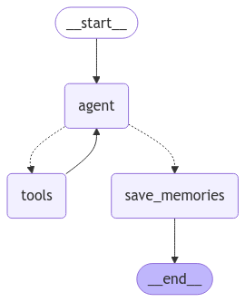
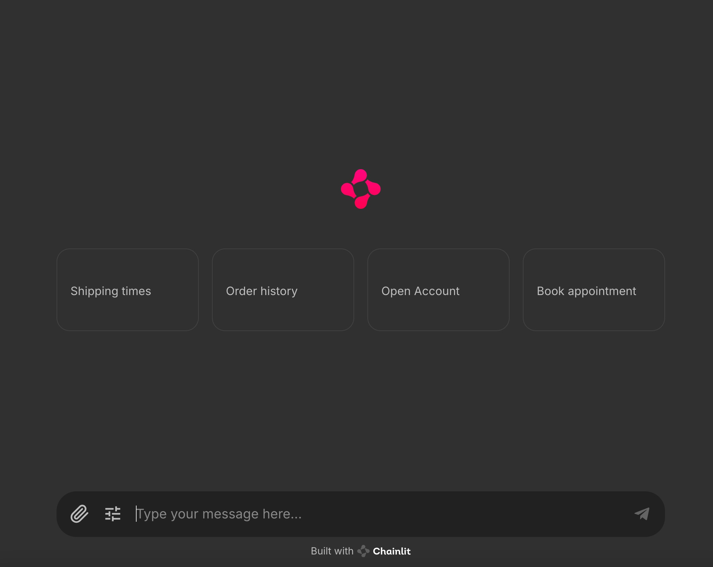
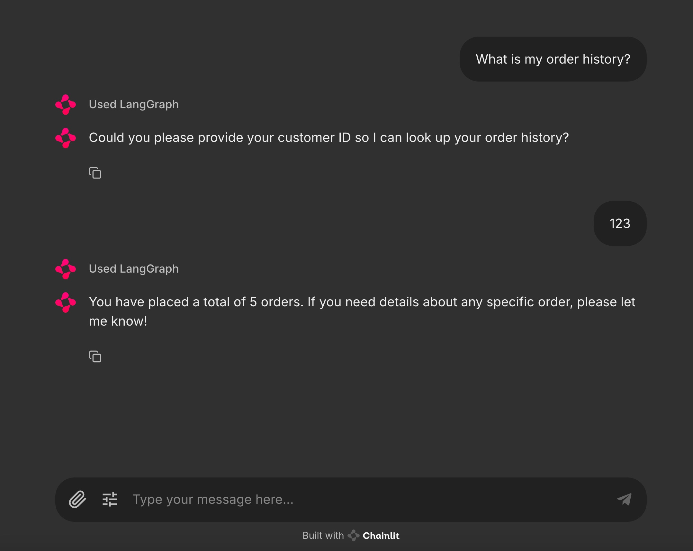
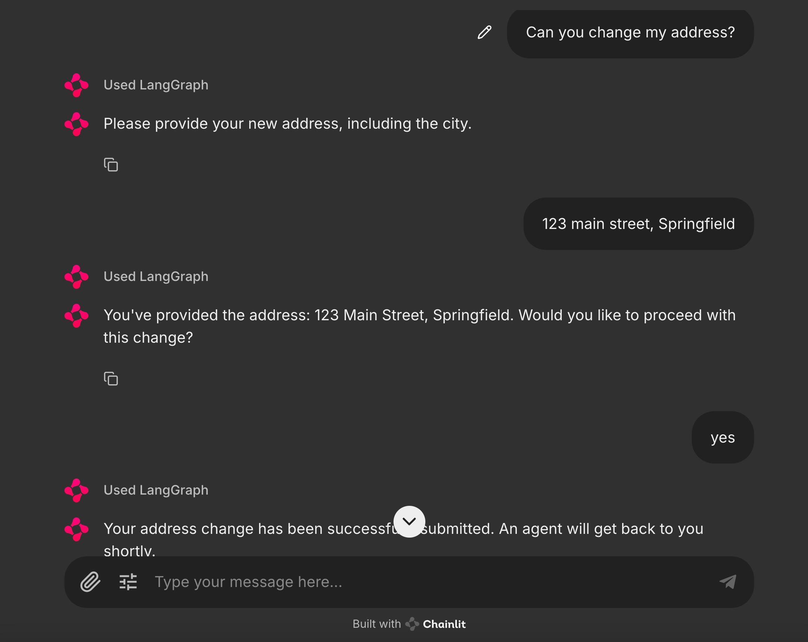

# React Agent with Long-Term Memory and Tool Integration  


This project demonstrates a **React Agent** built using **[LangGraph](https://langchain-ai.github.io/langgraph/tutorials/introduction/)** with advanced tool integration and long-term memory capabilities.
The agent is designed to assist users in customer support scenarios
with a rich set of tools and a sleek UI interface powered by **[Chainlit](https://docs.chainlit.io/get-started/overview)**.

## Features  
- **Knowledge Base Retriever**: Retrieves information from a FAISS-based knowledge base.  
- **Customer Information Tool**: Fetches user details for personalized support.  
- **Form Management**:  
  - Retrieve form details.  
  - Assist users in completing forms step-by-step.  
  - Submit forms and handle retries for any submission errors.  
- **Memory Capabilities**:  
  - **Save Memory**: Store contextual information during conversations.  
  - **Search Memory**: Retrieve past interactions to ensure continuity and context.  
  - Powered by **[Mem0AI](https://mem0.ai/)** for long-term memory management.  
- **Dynamic Chat UI**: A user-friendly interface created with **Chainlit** for seamless interaction with the chatbot.  

## Project Setup

1. Install dependencies with Poetry:  
   ```bash  
   poetry install  
   ```  

2. Setup environment variables:  Provide required api keys: OPENAI_API_KEY=your-api-key.

   ```bash  
   cp .env.example .env  
   ```  

3. Start the local server:  
   ```bash  
   make start  
   ```  

Access the API at http://localhost:8000

## Architecture  

The project utilizes **LangGraph** to define a conversational workflow, integrating tools and memory nodes. Below is an example diagram of the graph and the UI interface:  

### Graph Architecture  
  

### Chat UI  
  

### Sample conversations

1. Check order history of a customer:

      

2. Change user's address:

      
